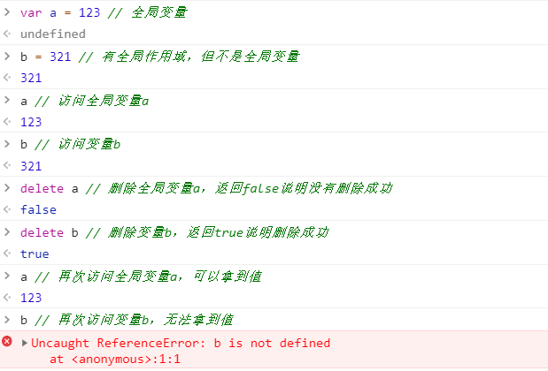

# ES6篇

该篇会讲述ES6的所有新特性，并且会复习ES6以前的相同知识

## 作用域

作用域从JS的层面分析有四个作用域：

### 全局作用域

#### 全局作用域解释

在全局作用域声明的变量（全局变量）可以在程序的任何地方都可以访问，也可以通过 `window` 对象的属性访问

#### 如何定义全局变量

只要在函数外面定义的变量基本都叫全局变量（ES3知识）

``` javascript
  var a = 123
  console.log(a) // 123
  console.log(window.a) // 123
```

> 注意：在任何地方（函数内部）未用声明语句（`var` `let` `const`）声明的变量虽然具备全局作用域，但严格意义上来讲不是全局变量，而是作为`window`（全局对象）的属性来使用。所以全局变量无法被 `delete` 删除，而未使用声明语句声明的变量则可以删除。
>
> 

### 函数作用域

#### 函数作用域说明

在函数内部通过 `var` 关键字声明的变量，该变量只能在函数内部访问，无法在函数外部访问

``` javascript
  function test () {
    var a = 1
    return a + 2
  }
  console.log(test()) // 3
  console.log(a) // a is not defined
```

### 动态作用域

### 动态作用域解释

与变量这种固定作用域不同，`this` 会根据不同的环境引用不同的对象，从而得到不同的值

``` javascript
  window.a = 1
  
  function test () {
    console.log(this.a)
  }

  // 在全局作用域中直接调用函数（没做任何劫持绑定），则函数中的this直接指向window对象
  test() // 1
  
  // 在全局作用域调用前给函数绑定一个对象，则函数中的this指向的是该绑定的对象
  test.bind({ a: 2 })() // 2
```

### 块状作用域（ES6新增）

#### 历史说明

在ES6之前没有块状作用域这个概念，在函数内部任何位置使用 `var` 定义的变量都会在函数执行前得到提升，使得在函数内部任何地方都能访问到该变量

``` javascript
  function test () {
    var a = true
    if (a) {
      var b = 1
    }
    console.log(b) // 1
  }
  test()
```

#### 块状作用域解释

在 `{}` 块内部通过 `let` 和 `const` 关键字声明的变量，该变量在 `{}`块内部访问，外面无法访问

``` javascript
  function test () {
    let a = 1
    if (a) {
      let b = 1
    }
    console.log(b) // b is not defined
  }
  test()
```

#### `let` & `const` 与 `var` 区别

该三个关键字的作用都是声明变量，通过 `var` 关键字声明的变量会在函数执行前声明提升，所以可以在声明语句前拿到变量的值，而通过 `let` & `const` 关键字声明的变量不会得到提升，也就无法在变量声明之前拿到变量的值。

``` javascript
  console.log(varA) // 1
  var varA = 1

  console.log(letA) // letA is not defined
  let letA = 1

  console.log(constA) // constA is not defined
  const constA = 1
```

使用 `var` 关键字可以重复声明相同变量。而使用 `let` & `const` 关键字无法重复声明相同变量

``` javascript
  var a = 1
  console.log(a) // 1
  var a = 2
  console.log(a) // 2

  let b = 1
  console.log(b) // 1
  let b = 2 // error: Identifier 'b' has already been declared
  console.log(b) // 不执行

  const c = 1
  console.log(c) // 1
  const c = 2 // error: Identifier 'c' has already been declared
  console.log(c) // 不执行
```

由于 `var` 关键字可以在声明时使变量提升特性，所以在块作用域（ `{}` ）内使用 `var` 关键字声明的变量，在 `var` 块作用域内外都可以使用。而 `let` & `const` 关键字由于没有变量提升特性，所以在块作用域内声明的变量，只能在块作用域内部使用，块作用域外部无法使用该变量

``` javascript
  {
    var a = 1
  }
  console.log(a) // 1

  {
    let b = 1
  }
  console.log(b) // error: b is not defined

  {
    const c = 1
  }
  console.log(c) // error: c is not defined
```

使用 `var` 在全局作用域声明的变量可以直接使用变量名访问，也可以使用全局对象（ `window` ）的属性进行访问，而 `let` & `const` 则只能通过变量名访问，无法通过全局对象的属性进行访问

``` javascript
  var a = 1
  console.log(a, window.a) // 1 1

  let b = 1
  console.log(b, window.b) // 1 undefined

  const c = 1
  console.log(c, window.c) // 1 undefined
```

#### `let` 与 `const` 区别

##### 说明

`let` 关键字的特性 `const` 都具备，且 `const` 拥有 `let` 不具备的特性

使用 `let` 关键字声明的变量为动态变量，可以在该作用域内做任何更改。而使用 `const` 关键字声明的变量为静态变量，在声明之后无法做任何更改

``` javascript
  let a = 1
  console.log(a) // 1
  a = 2
  console.log(a) // 2
  
  const b = 1
  console.log(b) // 1
  b = 2 // error: Assignment to constant variable.
  console.log(b) // 不执行
```

> 注意：在使用 `const` 关键字声明对象时，是无法改变指针的引用（也就是直接改成另一个对象），但可以改变该对象的属性
>
> ``` javascript
> const obj1 = { a: 1 }
> console.log(obj1) // { a: 1 }
> obj1.a = 2
> obj1.b = 3
> console.log(obj1) // { a: 2, b: 3 }
> const obj2 = { a: 1 }
> console.log(obj2) // { a: 1 }
> obj2 = { a: 2, b: 3 } // error: Assignment to constant variable.
> console.log(obj2) // 不执行
> ```

`let` 关键字可以先声明变量，后赋值。而 `const` 关键字只能在变量声明的时候赋值，并且声明之后无法做任何更改

``` javascript
  let a
  a = 1
  console.log(a) // 1

  const b
  b = 1
  console.log(b) // error: Missing initializer in const declaration
```

## Array

数组方面知识

### 数组遍历

数组遍历是循环数组进行每一个元素的操作

#### ES6以前的遍历方法，以及优缺点

##### 1. for 循环

使用 `for` 关键字对数组进行遍历和循环

优点：可以灵活的操作数组，并且可以随时使用 `break` , `continue` 等关键字跳出循环
缺点：写法相对来说较为复杂

``` javascript
  const arr = [1, 2, 3, 4, 5]
  for (let i = 0; i < arr.length; i++) {
    if (i === 2) {
      continue
    }
    console.log(arr[i])
  }

  // 1, 2, 4, 5
```

##### 2. forEach 遍历

使用ES5新增 `forEach` 关键字对数组进行遍历和循环

有点：写法相对简单，简洁，不需要定义变量等操作

缺点：会对数组的所有元素进行遍历，并且在遍历途中无法使用 `break` , `continue` 等关键字跳出循环

``` javascript
  const arr = [1, 2, 3, 4, 5]
  arr.forEach(function (item, index) {
    if (index === 3) {
      continue
    }
    console.log(item)
  })
  
  // 1
  // 2
  // 3
  // Error: Illegal continue statement: no surrounding iteration statement
```

##### 3. every 遍历

使用ES5新增 `every` 关键字对数组进行遍历和循环

特点：该遍历方法是根据每次执行的 `return` 值来决定是否继续循环，如果 `return` 的是 `true` , 则会进行下一次的循环。反之如果 `return` 的是 `false` ，则不在循环（默认 `return` : `false`  ）

优点：与 `forEach` 一样，写法相对简单。虽然不支持 `break` , `continue` 等关键字跳出循环，但可以 `return` 的特性进行跳出循环

缺点（也是特点）：如果要循环下一次，则需要在每次循环结束前，`return` 一个布尔值（`true`）

``` javascript
  const arr = [1, 2, 3, 4, 5]
  arr.every(function (item, index) {
    if (index === 3) {
      // 如果要实现类似break的效果，则可以返回一个false，让循环终止
      // 如果要实现类似continue的效果，则可以在条件里面不执行任何代码
      return false
    } else {
      console.log(item)
    }
    return true
  })

  // 1, 2, 3
```

##### 4. for in 遍历

> 注意：`for in` 本身是为对象的遍历而设计的，由于数组也是个对象，所以可以使用 `for in` 遍历数组。但由于是为对象设计的，所有遍历数组的手有瑕疵

特点：`for in` 通过拿到对象的key，从而通过key拿到key对应的值，但值得注意的是，这个key是一个字符串，而不是数字。更重要的是这个key不等于数组的下标

优点：可以使用 `for in` 遍历对象或数组，并且支持 `break`，`continue` 等跳出循环关键字

缺点：由于key值不是数组的下标，所以key可以是数组的非下标属性，可以循环出非下标的数据。key的类型是 `string` ，而下标的类型是 `number` 所以无法直接使用 `===` 进行判断，只能使用双等，或者在判断之前将两个不同类型值转为相同类型

``` javascript
  const arr = [1, 2, 3, 4, 5]

  for (let index in arr) {
    // 由于不同类型，使用 === 无法判断成功
    if (index === 2) {
      break // 支持跳出循环语句
    }
    console.log(index, arr[index])
  }

  // 0, 1
  // 1, 2
  // 2, 3
  // 3, 4
  // 4, 5

  // 由于key可以是数组非下标属性，所以也能循环显示出来
  arr.a = 6
  arr.b = 7

  for (let index in arr) {
    // 先将string类型的index转成number类型，然后在进行判断
    if (index * 1 === 2) {
      continue
    }
    console.log(index, arr[index])
  }

  // 0 1
  // 1 2
  // 3 4
  // 4 5
  // a 6
  // b 7
```

#### ES6新增遍历方法

##### for of 遍历

`for of` 既可以遍历数组，也可以遍历对象。可以修改默认遍历机制

#### 伪数组

概念：伪数组具备数组的一些特性（例如：`length` 长度 ，遍历等等），但不能直接调用数组的方法。

只要满足以下两个特征的对象就是伪数组：

1.对象是按照索引（0，1，2，3...）的方式存储数据的
2.具备一个 `length` 属性

常见伪数组：`DOM` 中的 `NodeList` 伪数组，以及方法中的 `arguments` 伪数组对象

##### ES5中如何将伪数组转换成数组

使用ES方法转换 `arguments` 和 `NodeList` 伪数组

``` javascript
  let args = [].slice.call(arguments) // collection
  let imgs = [].slice.call(document.querySelectorAll('img')) // NodeList
```

##### ES6中如何将伪数组转换成数组

可以使用 `Array` 构造函数的ES6新增方法 `from` 进行转换

``` javascript
  let args = Array.from(arguments) // collection
  let imgs = Array.from(document.querySelectorAll('img')) // NodeList
```

##### `from` 使用语法

语法：`Array.from(arrayLike, mapFunction, thisArg)` 第一个参数为伪数组，第二个参数为遍历函数，第三个参数为 `this` 对象

###### arrayLike 参数作用

该参数表示一个要被转换成数组的伪数组

###### mapFunction 参数作用

该参数表示对伪数组的遍历，遍历每一项 `item` 元素并且可以 `return` 值为元素赋值

使用小场景：

``` javascript
  // 需求：初始化长度为5并且每个元素的值都为1的数组
  
  // 使用ES5的方式初始话
  let array = Array(5)
  for (let i = 0; i < array.length; i++) {
    array[i] = 1
  }
  console.log(array) // [1, 1, 1, 1, 1]

  // 使用ES6的方式初始化
  let array = Array.from({ length: 5 }, function () {
    return 1 // 返回的值将会作为数组元素的值
  })
  console.log(array)
```

###### thisArg 参数作用

该参数表示 `mapFunction` 中的 `this` 指向（自己）
